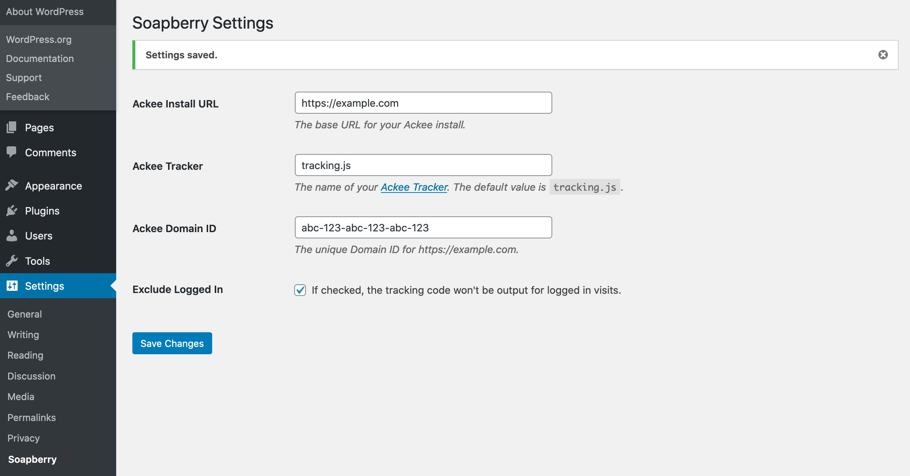

# Ackee WP 
**Contributors:** brookedot
**Tags:** tracking, analytics, stats
**Requires at least:** 4.1
**Tested up to:** 5.3.2
**Requires PHP:** 5.6
**Stable tag:** 1.0.0
**License:** GPLv3 or later
**License URI:** https://www.gnu.org/licenses/gpl-3.0.html

Ackee WP adds WP Admin options to support the JavaScript tracking code required by an external Ackee instance.

## Description

This plugin adds a settings page in WP Admin to set up the JavaScript tracking code required to track visits with an externally hosted [Ackee](https://ackee.electerious.com/) instance.

To use this plugin, one must have access to an Ackee instance with their  WordPress domain added as a domain in the setting and have that domain set in the [CORS headers](https://github.com/electerious/Ackee/blob/master/docs/CORS%20headers.md) of the Ackee domain.

Ackee is a:
> Self-hosted, Node.js based analytics tool for those who care about privacy. Ackee runs on your own server, analyses the traffic of your websites and provides useful statistics in a minimal interface.

Currently, the plugin's functionality is limited to the essential features to add the tracker to the footer.  In the future, the functionality might extend to tracking based on roles or the ability to use Ackee's personalization analytics with the visitor's opt-in.

## Installation

The quickest method for installing Ackee WP is:

1. Visit Plugins -> Add New in the WordPress admin
1. Search for "WP Ackee"
1. Click "Install Now"
1. Once the install is complete, click "Activate".
1. Go to the Settings -> WP Ackee to add your Ackee settings.

If you would prefer to do things manually, then follow these instructions:

1. Upload the `wp-ackee` folder to the `/wp-content/plugins/` directory
1. Activate the plugin through the 'Plugins' menu in WordPress
1. Go to the Settings -> WP Ackee to add the Ackee settings.

## Frequently Asked Questions

### The plugin is active but I do not see the tracking code

First, make sure your theme has the `wp_footer()` function added before the closing body tag. The plugin hooks into the WordPress footer, making this template tag required.

If you're still not seeing the tracking code, make sure your settings have been saved, and you do not have the "Exclude Logged In" checkbox enabled. If you are excluding logged in visits, then try loading your site in a private tab or another browser.

## Screenshots 

## Changelog 

### 1.0 
* Inital release